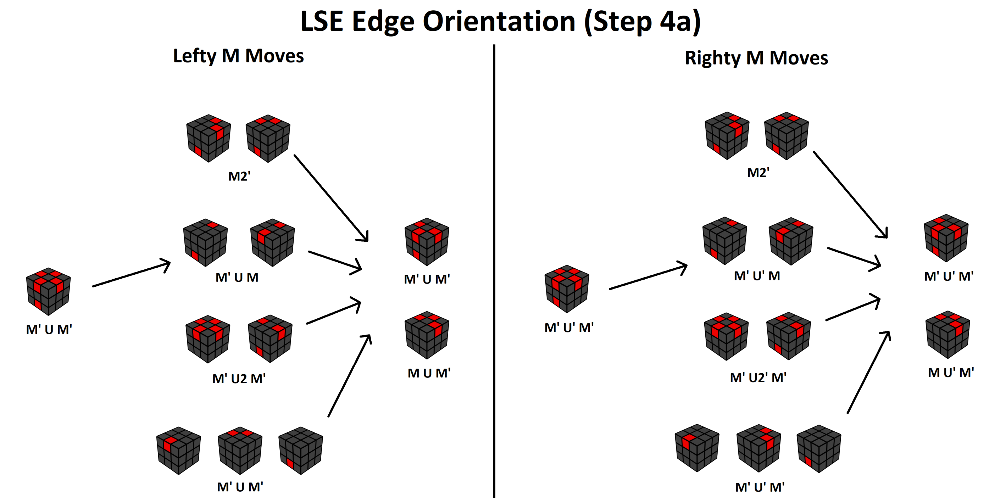

# LSE

## Objective

In this step, the goal is to solve the last six edges, which will actually end up solving the entire cube!

## Edge Orientation (EO)

> If you want to use a flowchart instead (more memorization and less intuition but faster to get the hang of), use [this link here](https://rouxl.es/images/LSEEO.png). You don't need to know the difference between 'lefty' and 'righty' just yet — just pick one side and stick to it.
> 
> This visual is also shown after the EO section is finished.

The first 'step' of LSE is to orient all the edges — making the white and yellow edges face either upwards or downwards. The colours on the other side of the edge does not matter for this step.

**Make sure you have either the white center or the yellow center on the U layer!** Correct edge orientation depends on this being the case — if it isn't, the remaining steps are going to not behave as normal as the edges aren't going to be oriented *relative to the centers*.

Type | Description
:-- | :--
Oriented Edge/Good Edge | Edge where the white/yellow sticker is facing either upwards or downwards.
Misoriented Edge/Bad Edge | Edge where the white/yellow sticker is **not** facing either upwards or downwards.

---

The general way to get to all edges oriented is to set up to an `arrow` case, where there are three misoriented edges on the top layer, and one misoriented edge on the bottom layer.

If you look at the top layer's misoriented edges, you can see a sort of `V` shape, which sort of looks like an arrow. If you first point the tip of the arrow on top of the misoriented edge in the bottom layer (see the examples below), then move the misoriented edge on the bottom layer to the tip (essentially moving it to the `U` layer using an `M`/`M'` move), then do a `U` or a `U'` (doesn't make a difference), and then do `M'` or `M`, you will then be able to solve the arrow case. This can be summarized in the steps below:

1. Move the tip of the arrow above the bottom misoriented edge.
2. Move the bottom misoriented edge to the `U` layer using an `M`/`M'` move.
3. Do a `U` or `U'`.
4. Do an `M` or `M'`.

Notice how in sum, doing the arrow case orients `4` misoriented edges? What that also can do is misorient `4` oriented edges, which can lead from other `EO` cases to the arrow itself. However, there are multiple configurations of `4` misoriented edges on the cube, which is what the next 'algorithm' can help remedy:

If you look at the front two edges (yellow-red and yellow-white edges), you can see that by doing `M' U2 M`, they swap positions. This applies for misoriented edges too!

Notice how after doing `M' U2 M` on the cube, the visual goes from having 3 misoriented edges on the top layer and 1 misoriented edge on the bottom layer to having 2 on top and 2 on bottom. In the example above, the red-white and orange-yellow edges swap position.

You can also do the swapping 'algorithm' from the back similarly to the arrow case.

In general, you can simplify the swapping algorithm to steps very similar to arrow:

1. Move the edge you want to swap above the bottom edge to swap.
2. Move the bottom edge to the `U` layer using an `M`/`M'` move.
3. Do a `U2`.
4. Undo the first `M` move you did by doing the opposite `M` move.

---

### Example 1:

Knowing this information, let's try our hand at some LSE cases:

First, check to see how many misoriented edges there are — 2.

> Hint: the number of misoriented edges will ALWAYS be an even number; likewise for oriented edges.

Then, remember that your goal is to do the arrow alg such that you can get to 4 misoriented edges in total. If you remember what edges the arrow cases flip, you can basically check to see what your end case will become.

From the first angle in the visual, if you do an arrow in the front, you will end up flipping two oriented edges and two misoriented edges, leaving you with a total of two misoriented edges, which means that it isn't the correct angle. **However**, if you do an arrow from the back, you flip one misoriented edge and three oriented edges, which in total leads to four misoriented edges if you include the misoriented edge that does not get affected in the front.

From the second angle, doing the arrow in the front leads to two misoriented edges, and doing it from the back leads to six misoriented edges, so we can ignore this angle.

The third angle is just a mirror of the first angle, so the same thing applies (just see for yourself).

In the fourth angle, if you do an arrow in the front, you end up flipping one misoriented edge and three oriented edges, leaving you with four misoriented edges in total. If you do an arrow in the back, you end also end up flipping one misoriented edge and three oriented edges, leaving you with four in total too.

After executing the arrow alg from the correct angle (in this case, `M U' M'`), we get the case in the visual below:

Notice how there are **four** bad edges in total, however we don't have the arrow case directly because we have two misoriented on the top, and two on the bottom, so we will have to do some swaps in order to set up to an arrow. In this case, we want to swap one of the oriented edges on the `U` layer with one of the misoriented edges on the `D` layer.

In the example below, the back two edges will be swapped, leading to an arrow case, which from there can lead to finishing EO.

Doing `M U2 M'` swaps the back two, making an arrow case. From there, `U2` sets up to the correct angle for the arrow case, from which `M' U M` solves the arrow case fully.

### Example 2:

In this case, we start off with all the edges misoriented. You can do the arrow from any angle here, because no matter what `U` move you do, you still have the same six misoriented edges.

From here, we have one misoriented on top and one misoriented on bottom, which is the same as the example shown earlier. From here you can just follow the same steps as Example 1.

Setup to arrow, then

solve EO!

---

## Solving the Left and Right edges 

In this step, the aim is to solve the edges that are part of the left and right sides of the cube. Due to the fact that we always start with the blue-white first block, this means that the edges in question are the green-yellow and blue-yellow edges. 

The simplest, and typically most efficient, approach is to put both the green-yellow and blue-yellow edges on the bottom layer, then doing an `M2` from the correct angle to solve the edges.

For example, you can do `M' U2 M` (front swap) here to bring the green-yellow edge to the `D` layer in the front.

Afterwards, `U M U2 M'` (setup to back swap) will put the blue-yellow edge to the `D` layer in the back such that both of the edges in question are located in the `D` layer:

After you get both of the edges onto the bottom layer, all that's left is to move the corners with `U` moves until doing an `M2` will solve the edges relative to their corners.

In this case, `U'` will move the corners to the correct position:

---

Small shortcut: you can actually do an `M2` to insert the first edge onto the `D` layer as long as your other edge isn't there. However, if you can't grasp this, stick with just doing the swapping moveset for now.

---

## EO Flowchart

In case you couldn't figure out how to solve a particular EO case, here is a simple flowchart (where lefty or righty M are for Rouxers who do M moves with their left or right hand respectively). Red-colored pieces are misoriented edges.

## Finishing the rest of the cube

You're nearly there!

Due to the properties of the Rubik's cube, if you solve the bottom two edges (including the centers), the rest of the cube will automatically solve itself. Sound familiar?

All you need to do is make sure the white center is on bottom (if it's not, you just need to do an `M2`), then from there, do the swapping moveset as many times as necessary until you solve the cube. This should be pretty intuitive, so there shouldn't really be a need for an example. You got this!